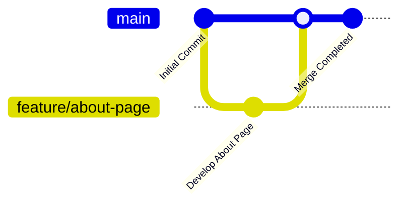

<div align="center">

# 🚀 Git Version Control Practice

### *A Professional Git & GitHub Workflow Demonstration*


**CodeMore Internship • Week 1 • Task 3**

*Learning Git, GitHub, Branching, Version Control and Best Development Practices.*

</div>

---

# 📖 About The Project

This repository was created as part of the **CodeMore Internship – Week 1 Task 3**.

The primary goal of this project is to gain practical experience with **Git** and **GitHub** by following a professional version control workflow used in modern software development.

Throughout this project, concepts such as repository initialization, commit history, branching strategies, merging, and project documentation are demonstrated using a simple HTML and CSS website.

---

# ✨ Features

- 📁 Git Repository Initialization
- 🌿 Feature Branch Workflow
- 📝 Meaningful Commit History
- 🔀 Branch Merging
- 📄 Professional Documentation
- 🌐 Static Website using HTML & CSS
- ☁️ GitHub Repository Hosting
- 🚀 GitHub Pages Deployment

---

# 🛠️ Tech Stack

| Technology | Purpose |
|------------|---------|
| HTML5 | Website Structure |
| CSS3 | Website Styling |
| Git | Version Control |
| GitHub | Repository Hosting |

---

# 📂 Project Structure

```text
git-version-control-practice/
│
├── README.md
├── .gitignore
├── index.html
├── about.html
│
└── css/
    └── style.css
```

---

# 📈 Git Workflow

```mermaid
flowchart LR

A[Create Project Folder]
-->B[Initialize Git Repository]
-->C[Create Project Files]
-->D[Stage Changes]
-->E[Create Commit]
-->F[Create Feature Branch]
-->G[Develop Feature]
-->H[Commit Changes]
-->I[Merge Into Main]
-->J[Push To GitHub]
-->K[Deploy Using GitHub Pages]
```



---

# 🌳 Branching Strategy



---

# 📋 Git Commands Practiced

```bash
git init
git add .
git commit
git branch
git checkout
git merge
git push
```

---

# 🎯 Learning Outcomes

Through this project I gained hands-on experience with:

- Repository Initialization
- Git Configuration
- Tracking File Changes
- Creating Professional Commits
- Branch Creation
- Branch Merging
- GitHub Repository Management
- Project Documentation
- GitHub Pages Deployment

---

# 📊 Development Workflow

## 📊 Development Workflow

| Step | Description | Status |
|------|-------------|--------|
| 1 | Create Project Structure | ✅ |
| 2 | Initialize Git Repository | ✅ |
| 3 | Create Landing Page | ✅ |
| 4 | Style Website | ✅ |
| 5 | Create Initial Commit | ✅ |
| 6 | Create Feature Branch | ⏳ |
| 7 | Merge Branch | ⏳ |
| 8 | Push to GitHub | ⏳ |
| 9 | Deploy via GitHub Pages | ⏳ |

> **Note:** Update the status as you complete each milestone.

---

# 💡 Best Practices Followed

- Organized project structure
- Meaningful commit messages
- Separate feature branch for development
- Clean and maintainable code
- Version control using Git
- Documentation with Markdown
- Public GitHub repository

---

# 📜 License

This project was developed for educational purposes as part of the **CodeMore Internship Program**.

---

# 👨‍💻 Author

## **Rachit Tripathi**

**B.Tech – Information Technology**

🐙 GitHub  
https://github.com/rachit1807

💼 LinkedIn  
https://linkedin.com/in/rachittripathi2509

---

<div align="center">

### ⭐ Thank you for visiting this repository!

If you found this project helpful, consider giving it a ⭐ on GitHub.

**Made with ❤️ by Rachit Tripathi**

</div>